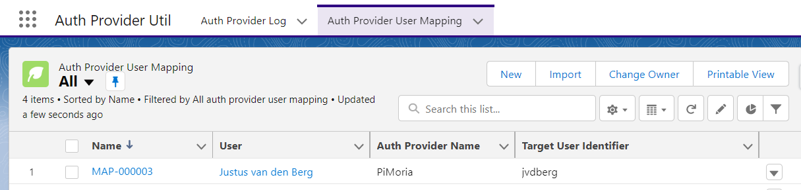
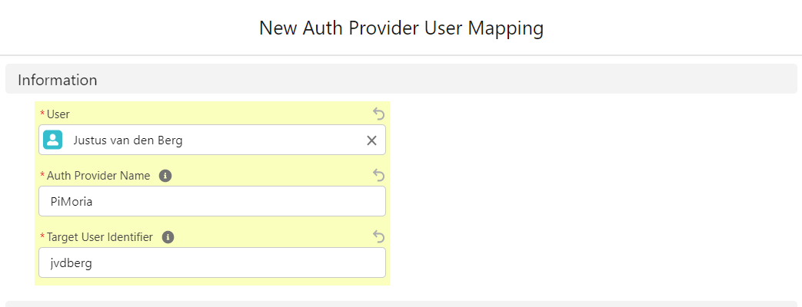
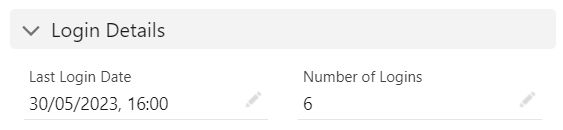
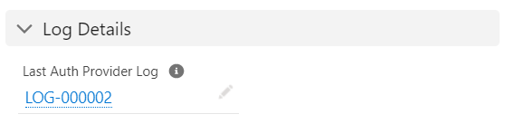
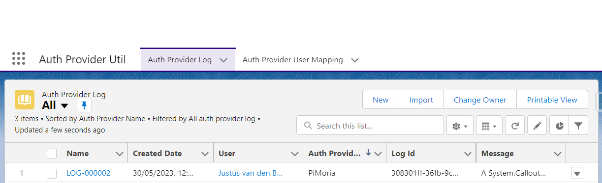

# Lightweight - Auth Provider Util v2
## Description
A lightweight utility that allows you to create a custom mapping between a Salesforce user and a user from an external system.
This can be used when you are connecting through a custom Auth Provider.

This utility also provides basic logging functions that can be used for debugging or monitoring any customization you have in your custom Auth Provider.

The utility consists of an App called "Auth Provider Util" and two sObjects: "Auth Provider Log" for storing the logs and "Auth Provider User Mapping" for storing the mappings between Salesforce users and external users.

There are also two platform event objects because Auth Providers cannot use DML, so we use a platform event with a trigger to create logging records and update the login information.

Note: Security implementation needs to be simplified in the next release.

## Dependency - Package Info
The following package need to be installed first before installing this package.
If you use the *managed package* you need to installed the managed package dependency and if you use the *unlocked version* you need to use the unlocked dependency.
| Info | Value |
|---|---|
|Name|Lightweight - Apex Unit Test Util v2|
|Version|2.3.0-1|
|Managed Installation URL | */packaging/installPackage.apexp?p0=04tP30000007oePIAQ*
|Unlocked Installation URL| */packaging/installPackage.apexp?p0=04tP30000007og1IAA*
|Github URL | https://github.com/jfwberg/lightweight-apex-unit-test-util-v2
| | |
|Name|Lightweight - Apex REST Util|
|Version|0.10.0-1|
|Managed Installation URL | */packaging/installPackage.apexp?p0=04tP30000007FOvIAM*
|Unlocked Installation URL| */packaging/installPackage.apexp?p0=04tP30000007FVNIA2*
|Github URL | https://github.com/jfwberg/lightweight-apex-rest-util 


## Auth Provider Util v2 - Package Info
| Package Info | Value |
|---|---|
|Name|Lightweight - Auth Provider Util v2|
|Version|0.8.0-1|
|Managed Installation URL | */packaging/installPackage.apexp?p0=04tP3000000DieLIAS*
|Unlocked Installation URL| */packaging/installPackage.apexp?p0=04tP3000000Dj5lIAC*

## Implementation example
An example (de-coupled) implementation can be found in the Lightweight - OAuth 2.0 JWT Client Credentials Auth Provider Repo
https://github.com/jfwberg/lightweight-oauth-jwt-client-credentials-auth-provider

Another example can be found in the Lightweight - Data Cloud Auth Provider Repo
https://github.com/jfwberg/lightweight-data-cloud-auth-provider

Another example can be found in the Lightweight - Salesforce Auth Provider Repo
https://github.com/jfwberg/lightweight-salesforce-auth-provider

## User Mapping
User mappings allow you to create a "Per User Principal" integration with a custom Auth Provider in combination with Named/External credentials.

1) Open the "*Auth Provider Util*" app through the app launcher
2) Go to the "*Auth Provider User Mapping*" tab

   

3) Click "*New*"
4) - Select the source org User
   - Give the API Name for the AuthProvider (This will be validated against the metadata
   - Give the name that is used in the external system to identify the user/subject
   - Other fields can be ignored
   
5) Press "*Save*"

You now have succesfully created a mapping that you can use in your custom Auth Provider logic.

## User Mapping methods
```java
// A method to check if a user mapping exists, your code can add custom validations using this method
Boolean userMappingExists = lwt.AuthProviderUtil.checkUserMappingExists(String authProviderName, String userId);

// Method to get the target subject name from the user mapping
String subject = lwt.AuthProviderUtil.getSubjectFromUserMapping(String authProviderName, String userId);
```

## Login Statistics
The auth provider mapping records contain two fields regarding the login:
- Last Login Date, This is the last time a user has retrieved a new or refresh token through the auth provider
- Number of logins, This is the total times a token/refresh token has been requested by the user

Using these fields are completely optional. They can be handy to track usage after the implementation. They do take up platform events so keep that in mind before hitting any limits.



## Login Statistics methods
```java
// Method to update the login detail fields for a specific user (void)
lwt.AuthProviderUtil.updateMappingLoginDetails(String authProviderName, String userId);
```

## Logging
In order to create a record from an Auth Provider a platform event is required due to the lack of DML support. There is only one type of logging event, but you can implement this how you want, i.e. success, error warning. Errors only will be the most common.

Keep in mind creating logs will efect your Platform Event limits so use accordingly.

If a mapping record with the Salesforce user Id and Auth Provider Name exists, the field "Last Auth Provider Log" record will be updated with a related record sot it can easily be traced when debugging a specific user.



Logs have a logId field that needs to be unique, use this with a GUID to keep your logs tracable.

## Logging methods
```java
// Method to insert a log entry
lwt.AuthProviderUtil.insertLog(String authProviderName, String userId, String logId, String message)

// Method to register a login for a certain user
lwt.AuthProviderUtil.insertLoginHistoryRecord(String authProviderName, String userId, String flowType, Datetime timestamp)
```

## Utility methods
```java
// Method to generate  Auth.UserData from the logged in user using the cookie header
// User this is you want to get current user details in an Auth Provider in a "Per User" mode
Auth.UserData authUserData = lwt.getAuthUserDataFromCookieHeader(String cookieHeader)
```

## View Logs
1) Open the "*Auth Provider Util*" app through the app launcher
2) Go to the "*Auth Provider Logs*" tab

3) Open any of the logs you'll need you can reference them by the log Id

## Security notes
There are two permission sets included:
1) *Auth Provider Util Admin*: Use this permission set for users that manage users mappings and are allowed to see the logs. This Permission Set gives full access.
2) *Auth Provider Util User*: Use this for users who only need to be able to use an Auth Provider. This permission set gives users only access to read their own mapping record, access to create a log event and update the login details for their own mapping record.

The Sharing model is set to private so users only have access to records they own.

The OwnerId field is set to the Salesforce user by a trigger to manage this.

!! As with every user mapping, whether its custom or the Federation Identifier fields, make sure the correct Admin access is supplied so users cannot impersonate other users by updating fields. Users should only have read access to to the mapping object to prevent impersonation. Again, speak to your security expert to validate all settings.!!

## Callable Implementation
To keep packages loosely coupled the callable interface has been implemented.
Not every package Auth Provider you use will need this package, to allow for loose coupeling the *Callable* Interface has been implemented.

```java
/**
 * Implementation example where the class is dymically instanciated
 * and each method is resolved at run time.
 * Use this if you want to loosely couple the package
 */
// 
Callable authProviderInstance = (Callable) Type.forName('lwt.AuthProviderUtil').newInstance();

// void
authProviderInstance.call('insertLog', new Map<String, Object> { 
    'authProviderName' => authProviderName,
    'userId'           => userId,
    'logId'            => logId,
    'message'          => message
});

// void
authProviderInstance.call('insertLoginHistoryRecord', new Map<String, Object> { 
    'authProviderName' => authProviderName,
    'userId'           => userId,
    'flowType'         => 'Refresh', // Initial or Refresh 
    'timestamp'        => Datetime.now()
});

Boolean checkUserMappingExistsResult;
checkUserMappingExistsResult = (Boolean) authProviderInstance.call('checkUserMappingExists', new Map<String, Object> { 
    'authProviderName' => authProviderName,
    'userId'           => userId
});

Object updateMappingLoginDetailsResult;
updateMappingLoginDetailsResult = authProviderInstance.call('updateMappingLoginDetails', new Map<String, Object> { 
    'authProviderName' => authProviderName,
    'userId'           => userId
});

String getSubjectFromUserMappingResult;
getSubjectFromUserMappingResult = (String) authProviderInstance.call('getSubjectFromUserMapping', new Map<String, Object> { 
    'authProviderName' => authProviderName,
    'userId'           => userId
});


Auth.UserData getAuthUserDataFromCookieHeaderResult;
getAuthUserDataFromCookieHeader = (Auth.UserData) authProviderInstance.call('getAuthUserDataFromCookieHeader', new Map<String, Object> { 
    'cookieHeader' => cookieHeader
});

```

## Links
- https://help.salesforce.com/s/articleView?id=sf.nc_user_external_credentials.htm&type=5
- https://help.salesforce.com/s/articleView?id=sf.nc_create_edit_oath_ext_cred.htm&type=5